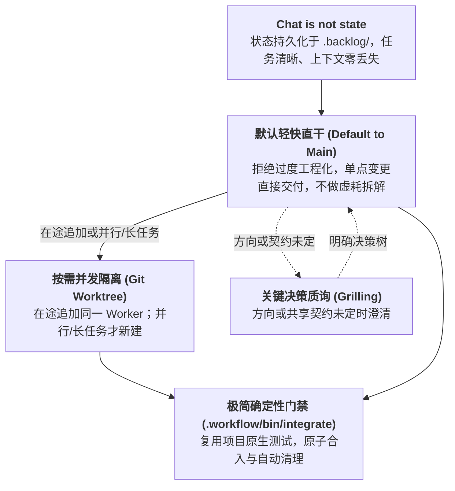
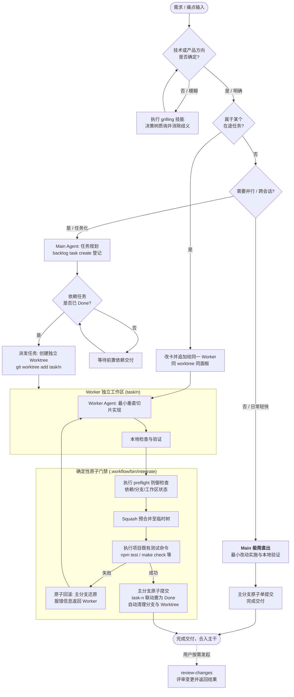

# Loom Workflow

> **少即是多（Less is More）：面向强模型时代的新一代轻量编码范式。**  
> 拒绝过度工程化与繁琐内耗，以极简必要的约束，换取井井有条的工程秩序与极致交付效率。

[](https://git-scm.com/docs/git-worktree)
[](https://github.com/Mr-Pepe/backlog.md)
[](INSTALL.md)
[](AGENTS.md)

---

## 📖 什么是 Loom？

在强模型时代，大语言模型的代码生成与局部推理能力已经高度成熟。然而，许多多 Agent 框架和工作流却走入了另一个极端——**过度规范与过度工程化（Over-engineering）**：
- 为了完成一个简单的功能点，强行拆解出无数层子任务与嵌套管道；
- 频繁跨 Agent 调度与重复对审，导致单任务执行时间严重膨胀甚至失控（如某些重型框架动辄耗费数十分钟、跑出海量无意义会话）；
- 繁文缛节不仅没有换来更高的工程质量，反而极大地扼杀了开发者的交付心流与效率。

**Loom 的核心哲学是：少即是多（Less is More）。**

强模型时代不需要保姆式的层层束缚。Loom 摒弃了一切形式主义的过度工程化设计，遵循**“极简必要约束，清晰工程治理”**的原则，让工作井井有条：

1. **默认轻快，直出主干（Default to Main）**：绝不无谓拆解任务。日常单点变更直接在 `main` 分支一气呵成完成验证与提交，保持极高吞吐；
2. **任务管理，井然有序（Chat is Not State）**：以极简轻量的 `.backlog/` 本地文本持久化状态，杜绝会话上下文膨胀与遗忘，随时无损重启或交接；
3. **按需隔离，并发无扰（Git Worktree）**：仅在真正需要并行或跨会话的长任务时，才派发独立工作树，物理隔离；属于在途任务的追加需求改卡后交给同一个 Worker，不重复派发；
4. **推断门禁，绝不发明（Deterministic Integration）**：直接复用宿主项目现有的测试/构建脚本（`npm test` / `cargo test` / `make check` 等），门禁脚本只做确定性原子校验、合入与清理，零外部侵入。
5. **一人对话，全局调度（Orchestrator Mode）**：手动输入 `/orchestrator`，当前会话只负责沟通、规划、派发与验收，实现全部交给独立 Worker，走的仍是同一套任务与门禁（详见下文「调度者模式」）。
6. **按需评审，自主选择（Review Changes）**：完成一批任务后，通过 `review-changes` 集中评审。你决定何时评审、评审哪些改动，以及使用什么评审方式。

---

## 🚀 快速接入

### 一键安装或更新（面向宿主项目）

在目标项目里把下面这句发给编码 Agent（Cursor / Claude Code / Codex / Antigravity），安装和更新都用它：

```text
安装或更新工作流：读取 https://github.com/shiguangwl/Loom-Workflow 的 INSTALL.md 并照做。
```

Agent 比对两边的 `.workflow/VERSION`：没装过就安装，版本落后就更新，已是最新且清单与磁盘一致就直说；缺清单或清单与磁盘不一致时会补齐安装状态。更新会保留宿主自己加的 `AGENTS.md` / Claude 入口内容和任务数据，只更新指定的运行文件与技能路径。`INSTALL.md`、`README.md`、`skills-lock.json` 是源仓库开发资产，安装只读取它们，不复制或覆盖宿主同名文件；宿主的 `.workflow/installed-files.json` 记录可安全清理的单个文件/链接。安装后不记录来源、不关联本仓库，下次更新再发一次这句即可。

### 前置依赖

本工作流保持极简依赖，只需开发环境具备：
- `git`
- `python3`（供 `integrate` 门禁解析 Backlog 元数据）
- `backlog.md`（轻量级本地任务管理工具）：
  ```bash
  npm i -g backlog.md
  ```

---

## 🧭 调度者模式（Orchestrator）

手动触发的会话模式。触发后，当前会话成为 Orchestrator：你只和它对话，它负责澄清需求、规划任务、派发 Worker、验收与合入，自己不改项目文件。

| | 默认模式 | Orchestrator 模式 |
|---|---|---|
| **谁来实现** | 主 Agent 默认在 `main` 直出，并行/长任务才派发 | 项目文件的改动全部派发给 Worker |
| **任务与合入** | 按需创建 Backlog 任务 | 每个改动都走任务路径：归入在途任务，否则新建任务 → 独立 worktree → `integrate` |
| **你要做的** | 需要时说“派 task-3”“合 task-3” | 只谈需求与决策；派发、验收、合入由它推进并汇报 |

它只覆盖 `AGENTS.md` 中“主 Agent 默认在 `main` 上实现”这一条，其余规则原样沿用，不引入新的流程分支；对应全景图中“需要并行 / 跨会话？”恒走任务化分支。

- **触发**：Claude Code 输入 `/orchestrator`，Codex 输入 `$orchestrator`。只能由用户手动触发，Agent 不会自行进入；说一声即可退出。模式不跨会话，新会话重新触发，状态从 `.backlog/` 重建。
- **派发时机**：明确指令直接派发；讨论中产生的工作，先按任务卡复述目标与验收标准，你同意后才派发。
- **任务卡即简报**：Worker 全新启动，只被告知任务号、worktree 路径和主检出路径，其余信息都在任务卡上；Worker 的疑问回到 Orchestrator，答案记入任务卡。
- **验收把关**：`integrate` 只保证检查通过，不保证验收标准达标。合入前对照任务卡审 diff，返工退回 Worker；通过即自动合入并汇报。

适合连续交付多个需求的长会话。单点小改动不必开启：此模式下改一行字也要走任务与合入。

---

## 手动评审（Review Changes）

连续完成多个任务后，可以用 `review-changes` 发起一次集中评审。是否评审、何时评审由你决定，工作流不会在每个任务结束后自动启动，也不要求 Claude Code 与 Codex 互相评审。

| 使用的工具 | 调用方式 |
|---|---|
| Claude Code | `/review-changes` |
| Codex | `$review-changes` |

- **评审范围**：默认评审当前会话的提交。你也可以直接说明要检查的任务、提交或其他范围；无法确定范围时，Agent 会先询问。
- **评审方式**：优先复用当前环境已有的评审技能。你可以指定其他技能或评审方式，也可以补充希望重点检查的问题。
- **结果处理**：默认返回评审结果。收到结果后，再决定是否让 Agent 修复，以及修复哪些问题。
- **日常验证**：测试、构建、需求验收和合入检查照常执行，不需要等你发起评审。

例如，在 Codex 中可以这样使用；Claude Code 使用 `/review-changes` 作为入口：

| 需求 | 示例 |
|---|---|
| 一批任务完成后统一评审 | `$review-changes` |
| 只检查某部分改动 | `$review-changes 只评审这次支付流程相关的提交` |
| 补充评审重点 | `$review-changes 重点检查接口兼容性和错误处理` |

`review-changes` 本身不提供一套固定的评审标准。具体如何检查由实际使用的评审技能或你指定的方式决定。

---

## 💡 设计哲学：强模型下的新一代编码范式



### 1. 对话不是状态，任务持久化落盘（Chat is not state）
- **痛点**：传统 AI 编程依赖会话上下文（Chat Context）暂存任务状态。随着会话拉长，不仅上下文急剧膨胀、token 消耗失控，模型还会出现严重的遗忘与幻觉。
- **Loom 实践**：会话仅用于即时交互，**任务目标、决策记录、验收标准（AC）全部沉淀于本地 `.backlog/` 文本库**。任务卡只在本机、不进 git；关键决策随最终提交的 Why 段进入历史。通过轻量 CLI 工具（`backlog task list --plain`），任何 Agent 在任何时刻加入协作，都能在数毫秒内无损重建全局认知。

### 2. 少即是多：默认主干轻快，按需任务隔离（Default to Main, Isolate On-Demand）
- **痛点**：很多工作流机械化地要求“任何修改必须先开卡、再切分支、再跑流程”，导致改动几行代码耗费半小时，严重拖慢迭代速度。
- **Loom 实践**：
  - **默认在 `main` 直出**：一个逻辑改动、一次即时检查、一个规范 Commit。杜绝简单事情复杂化；
  - **仅在必要时派发 Worktree**：只有当工作**需要多 Agent 并行开发**或**跨越多轮长会话**时，才创建 `task-<n>` 并通过 `git worktree` 派发独立工作树；
  - **追加不重派**：新需求若改变某个在途任务的产出、或碰到它的区域，就归入那个任务：改卡，交给同一个 Worker 在同一个面板继续；只有与所有在途任务无关、或相关任务已 Done 的工作才新建任务；
  - **最小垂直切片**：派发的 Worker 智能体以极简端到端垂直切片为目标，工作区物理隔离，专注交付，互不干扰。

### 3. 推断而非发明：极简确定性机械门禁（Infer, Don't Invent）
- **痛点**：为了实现所谓的全自动，在工作流里塞入庞大复杂的自定义流水线或新增各种冗余配置文件，对宿主项目带来极高侵入性。
- **Loom 实践**：
  - **零外部发明**：`.workflow/bin/integrate` 会直接自动推断目标项目已有的测试/构建脚本（如 `package.json`、`Makefile`、`Cargo.toml` 等），绝不发明宿主没有的检查；
  - **确定性原子把关**：机械检查分支是否洁净、前置依赖是否交付、原有测试是否全绿。通过则一键 Squash 合入并自动关闭任务、删除临时分支；未通过则触发原子级硬回滚，主干不留半点污染。

### 4. 方向未定先澄清，评审由用户发起（Grilling & Manual Review）
- **痛点**：在每个琐碎环节都强制插入多模型交叉会审，白白消耗大量时间与调用成本。
- **Loom 实践**：
  - **方向模糊才质询**：仅在技术选型不确定、核心契约待定或需求存在歧义时，才调用 `grilling` 技能进行决策树穷追质询，先锁死设计边界再动手；
  - **评审手动触发**：开发与合入照常执行项目检查；代码评审由用户按需发起，可以集中检查一批任务，也可以指定范围和评审方式。

### 5. 零配置与完全无侵入（Drop-in & Non-invasive）
- **Loom 实践**：整个工作流纯由透明文本规约（`AGENTS.md`）与极简 Shell 脚本构成，**绝不侵入目标项目的业务代码、现有测试框架与依赖锁文件**。任何现有代码库只需一条指令即可接入或平滑升级。

---

## 🔄 工作流全景运转流程



---

## 📁 目录与核心资产

```text
├── AGENTS.md                 # 核心规约：多 Agent 协同准则与边界契约（根目录必须）
├── CLAUDE.md                 # 工具重定向（指向 @AGENTS.md，兼容 Claude Code）
├── README.md                 # 源仓库资产：项目说明，不复制到宿主
├── INSTALL.md                # 源仓库资产：交由 Agent 执行的安装与更新规范，不复制到宿主
├── skills-lock.json          # 源仓库资产：维护 Loom 自身依赖，不覆盖宿主同名锁文件
├── .backlog/                 # 任务状态中枢：Backlog.md 本地任务库，只通过 CLI 读写；任务卡不进 git，只跟踪 config.yml
│   └── config.yml            # 任务配置（项目名、状态集：To Do / Done 等）
├── .agents/skills/           # 赋能技能库
│   ├── grilling/             # 决策质询技能（消除模糊与设计树推演）
│   ├── herdr/                # 终端复用与多 Agent 编排技能
│   ├── orchestrator/         # 调度者模式（仅手动触发）：本会话沟通、派发与验收，实现全部委派
│   └── review-changes/       # 手动发起评审：默认检查本会话提交，支持用户指定范围与方式
├── .claude/skills/           # 符号链接（指向 .agents/skills/，兼容 Claude 生态）
└── .workflow/
    ├── bin/integrate         # 核心门禁脚本：自动化校验、原子合入与任务状态流转
    ├── VERSION               # 工作流版本号，安装与更新时比对
    └── installed-files.json  # 宿主安装成功后生成的状态清单；不提交源仓库
```

---

## 🛠️ 开发者与 Agent 实战手册

### 1. 常用命令速查

| 场景 | 命令 / 操作 | 说明 |
|---|---|---|
| **查看看板** | `backlog board` | 终端直观查看任务泳道状态 |
| **列出任务** | `backlog task list --plain` | 适合 Agent 读取的高密度无格式任务列表 |
| **创建任务** | `backlog task create "<标题>" --ac "<验收标准>" [--dep <前置ID>]` | 明确边界与依赖创建任务 |
| **查看详情** | `backlog task view task-<n>` | 读取单卡的目标、决策与 AC |
| **派发任务** | `git worktree add ../<repo>-task-<n> -b task/<n> main` | 为 Worker 创建隔离的工作树空间 |
| **自动化合入** | `.workflow/bin/integrate <n> -- <质检命令>` | **在 main 分支执行**，校验并合入任务 |
| **手动评审** | `/review-changes` / `$review-changes` | 评审本会话提交或用户指定范围 |

### 2. 典型人机交互场景口令

- **方向未定？先磨刀（Grilling）**：
  > “我想重构鉴权模块，但技术选型还在纠结，请运行 grilling 技能向我提问，帮我理清设计决策树。”
- **日常单点改动（Default to Main）**：
  > “直接在 main 分支修复这个样式对齐问题，完成本地验证后提交。”
- **拆分与编排任务（并发/长任务）**：
  > “请评估当前需求，在 main 分支规划并创建对应任务，明确 AC 和依赖关系。”
- **并行派发 Worker**：
  > “请将 task-3 派发至独立 worktree 并启动 Worker 开始交付，完成后汇报我。”
- **原子验收与合入**：
  > “task-3 开发完成，请在 main 执行合入，使用项目的全量测试脚本 `npm test` 作为质量门禁。”
- **本会话只做调度（Orchestrator）**：
  > `/orchestrator`（Codex 用 `$orchestrator`），行为见上文「调度者模式」。
- **一批任务完成后集中评审（Review Changes）**：
  > `/review-changes 重点检查这批任务之间是否存在冲突或遗漏`（Codex 用 `$review-changes`）。

---

## 📝 提交规范与协作守则

主干上的所有提交记录均对应一次完整逻辑变更或一次合入的任务，严格遵循统一 Commit 规范：

```text
<type>(<scope>): 中文祈使句描述

What
- 本次变更的核心内容说明

Why
- 关键决策、原因与取舍；有任务卡时保留其中值得长期追溯的决策
```

小改动若标题已充分说明，可省略正文。

- **Type 类型**：`feat` / `fix` / `refactor` / `docs` / `test` / `chore` / `perf` / `style` / `build` / `ci`
- **版本号**：修改 `INSTALL.md` 清单内的文件时，同步提升 `.workflow/VERSION`（语义化版本），否则已安装的项目会被判定为已是最新。
- **规则优先级**：项目级规则与协作约定统一汇总于仓库根目录的 `AGENTS.md`，所有进入此流程的 Agent 均需严格遵守。
